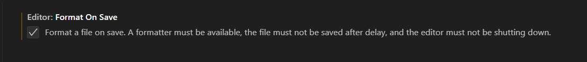
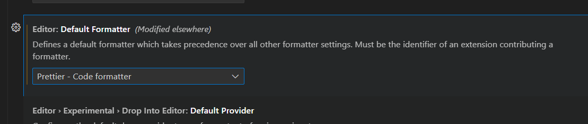
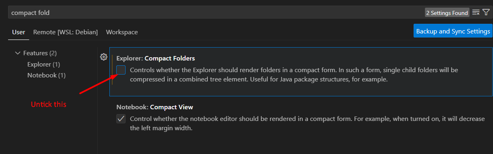
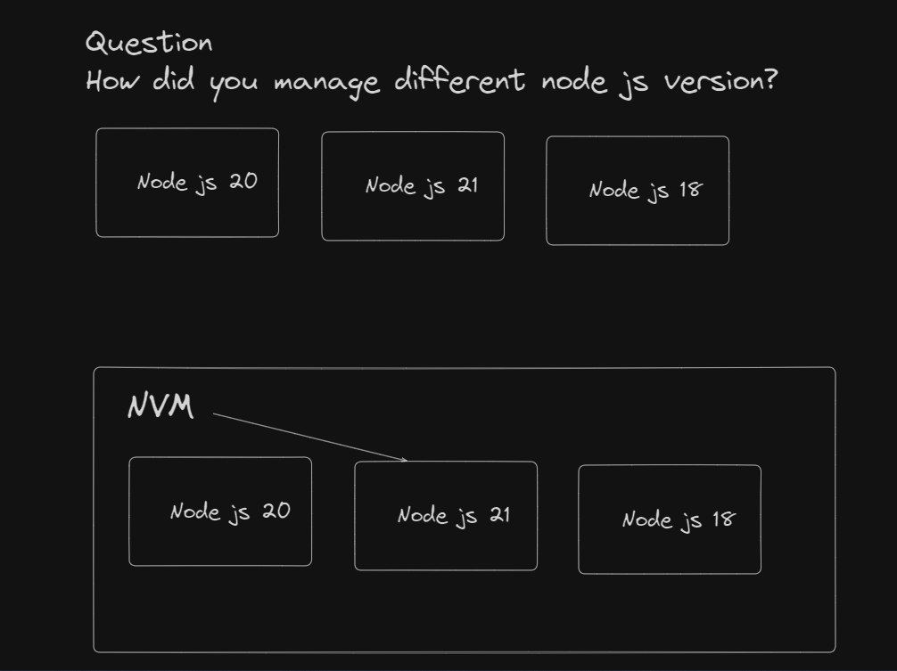

1. Browser extension
   - Metamask


---

2. VS code
	- Extensions
		- Prettier
		- Solidity
		- Material Icon Theme
		- React

	- Setting
		- Format on save (tick the box)
		- Default Formatter (Select Prettier)
		- Compact Folder (untick the box)







Prettier setting
- Single quote


```
//test vs code formatter
//Steps
1.Create an empty folder and open it with vs code
2.Create a file "abc.ts"
3.Copy all the code and paste it into abc.ts
4.Save it
```

```
const hello = 'Hello world';

    const helloTing = 'Hello world';

const helloTong = 'Hellow world Hellow Hellow';

function addNumber() {
  console.log(`Hello world ${helloTing}`)
      console.log(`Hello world ${helloTing}`);
  console.log(`Hello world ${helloTing}`);
      console.log(`Hello world ${helloTing}`);
}

addNumber()

```

```
//After save, the code should look like this

const hello = 'Hello world';

const helloTing = 'Hello world';

const helloTong = 'Hellow world Hellow Hellow';

function addNumber() {
  console.log(`Hello world ${helloTing}`);
  console.log(`Hello world ${helloTing}`);
  console.log(`Hello world ${helloTing}`);
  console.log(`Hello world ${helloTing}`);
}

addNumber();


```


---

3. Window Terminal

4.  NVM Window
	- Node Js




5. Jetbrain IDEA
	 - Remaining Java Tutorial


6. MarkTest
---


