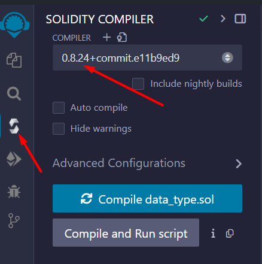
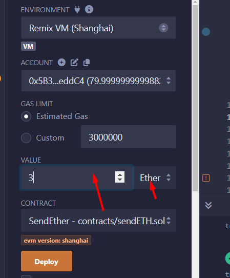
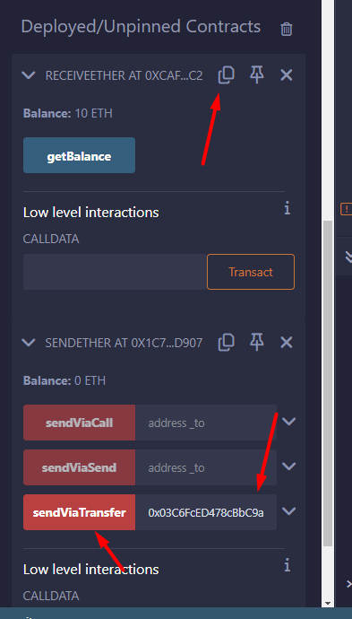

Notes: Compiler need to select 0.8 to 0.24. Above 0.24 have issue. 



## Hello World

```
// SPDX-License-Identifier: MIT

pragma solidity ^0.8.24;

contract HelloWorld {
    string public message = "Hello World!";
}

```


---

## Data type + Function


```
pragma solidity ^0.8.0;

contract DataType {

    bool isActive = true;

    uint256 studentId = 123456;

    int256 accountBalance = -100; 

    address walletAddress = 0xAb8483F64d9C6d1EcF9b849Ae677dD3315835cb2;

    function toggleActive() public {
        isActive = !isActive;
    }

    function incrementStudentId() public {
        studentId += 100;
    }

    function viewData() public view returns (bool, uint256, int256, address) {
        return (isActive, studentId, accountBalance, walletAddress);
    }
}


```


---


<div style="page-break-after: always;"></div>


## If else / Loop

```

//if else

pragma solidity ^0.8.0;

contract Voting {

    uint public age;

    constructor(uint _age) {
        age = _age;
    }

    function canVote() public view returns (bool) {
        if (age > = 18) {
            return true;
        } else {
            return false;
        }
    }
}


// loop

pragma solidity ^0.8.0;

contract SimpleForLoop {

    uint256[] private numbers = [1, 2, 3, 4, 5];

    function totalValue() public view returns (uint256 sum) {

        uint256 total = 0;

        for (uint256 i = 0; i < numbers.length; i++) {

            total += numbers[i];

        }

        return total;
    }
}


```


---


<div style="page-break-after: always;"></div>


## Array / Mappings

```

//Array
pragma solidity ^0.8.0;

contract SimpleArray {

    string[3] public colors = ["red", "green", "blue"];

    function getColor(uint256 index) public view returns (string memory) {
        require(index < colors.length, "Index out of bounds");
        return colors[index];
    }
}


//Mapping example
//Associate array in php

pragma solidity ^0.8.0;

contract StudentNameMap {

    mapping(address => string) public studentNames;

    function registerStudent(string memory name) public {
        studentNames[msg.sender] = name;
    }

    function getMyName() public view returns (string memory) {
        return studentNames[msg.sender];
    }
}


```


---


### Receive and Send Ether

```

// SPDX-License-Identifier: MIT
pragma solidity ^0.8.24;
contract receiveEther{
	event ReceivedEther(address indexed sender, uint256 amount);
	receive() external payable {
		emit ReceivedEther(msg.sender, msg.value);
	}

	function getBalance() public view returns (uint256) {
		return address(this).balance;
	}
}


// SPDX-License-Identifier: MIT
pragma solidity ^0.8.24;
contract SendEther {
    
    function sendViaTransfer(address payable _to) public payable {
        _to.transfer(msg.value);
    }

    function sendViaSend(address payable _to) public payable {
        bool sent = _to.send(msg.value);
        require(sent, "Failed to send Ether");
    }

	function sendViaCall(address payable _to) public payable {
        (bool sent, bytes memory data) = _to.call{value: msg.value}("");
        require(sent, "Failed to send Ether");
    }
}
```







<div style="page-break-after: always;"></div>


---


<div style="page-break-after: always;"></div>
### Pure / View

```

pragma solidity ^0.8.0;

contract FunctionType {

  uint256 public num = 10;

  function addOne(uint256 a) public pure returns (uint256) {
    return a + 1;
  }

  function doubleStoredValue() public view returns (uint256) {
    return num * 2;
  }
}


```

|                |                                             |                                        |
| -------------- | ------------------------------------------- | -------------------------------------- |
| **Feature**    | **View Function**                           | **Pure Function**                      |
| Reads data     | Yes                                         | No                                     |
| Modifies state | No                                          | No                                     |
| Gas cost       | Lower                                       | Lowest                                 |
| Use cases      | Read-only calcul**ations, r**etrieving data | Simple calculations, independent logic |


---


<div style="page-break-after: always;"></div>
## Struct

```

pragma solidity ^0.8.0;

contract Person {

  struct Student {
    string name;
    uint256 age;
    address walletAddress;
  }

  Student public john;

  constructor() {
    john.name = "John Doe";
    john.age = 30;
    john.walletAddress = msg.sender; 
   }

  function updateStudentAge(uint256 newAge) public {
    john.age = newAge;
  }

  function getStudentName() public view returns (string memory) {
    return john.name;
  }
}


```


---
---

<div style="page-break-after: always;"></div>

#### Exercises

##### Question 1

Create a smart contract that can collect ether.
- Check ether balance
- Transfer all the ether to owner of the contract
- Receive ether


---

##### Question 2

**Scenario:**

A professor wants to create a transparent and immutable record of student grades using blockchain technology. They require a smart contract that allows them (with proper access control) to:

1. Add students to the gradebook.
2. Assign grades to students (numerical values).
3. Retrieve a student's information (name and grade).

---

##### Question 3

**Scenario:**

A group of artists wants to create a platform where they can showcase and sell their digital artwork directly to collectors, eliminating intermediaries and ensuring secure ownership tracking. They require a smart contract that allows:

1. Artists to upload artwork and mint NFTs representing ownership.
2. Collectors to purchase NFTs using cryptocurrency.
3. Secure and transparent ownership transfer upon purchase.


---

THE END  :) Enjoy coding.
 
---

