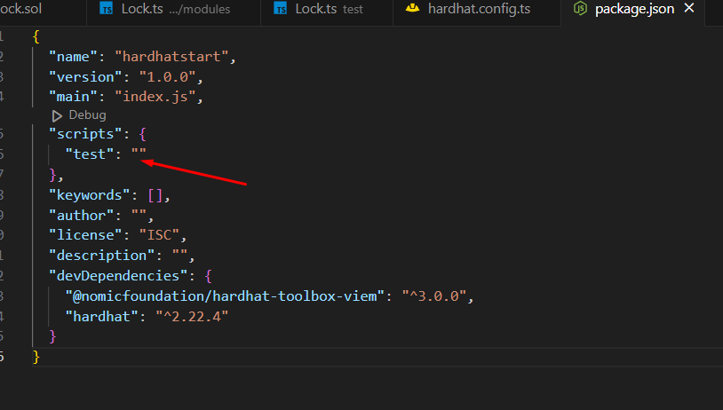

## Initial setup

```
npm init -y

npm install --save-dev hardhat

npx hardhat init

npx hardhat --version

```


---

### Read and test default lock contract

Copy and throw the code to remix ide. 
```
contracts/Lock.sol
```

https://www.epochconverter.com/

```
    //Add the following function to the lock contract
    function getCurrentTime() public view returns(uint256){
        uint256 currentTime = block.timestamp;
        return currentTime;
    }
```


---

### Read and run test file

```
/test/Lock.ts


//Command to run the test file
npx hardhat test

//Powershell command
$env:REPORT_GAS="true"; npx hardhat test

//Linux or mac
REPORT_GAS=true npx hardhat test

```

---

<div style="page-break-after: always;"></div>

### Run hardhat blockchain

```
//Command
npx hardhat node
```


Notes: port conflict
```
//U need to kill process that use the port

//In powershell
netstat -ano | findstr :8545
taskkill /PID <process Id> /F

//In linux
lsof -i :8545
kill [process id]

```


---

### Deploy smart contract

```

//Add the following code to hardhat configuration file -- hardhat.config.ts

  networks: {
    localhost: {
      chainId: 31337,
      url: 'http://127.0.0.1:8545',
    }
  }


//Command to deploy
npx hardhat ignition deploy ./ignition/modules/Lock.ts --reset --network localhost

```

#### Questions
1. How do I get the chainId? (Google search or hardhat documentation)
2. How do I get the url? (Over the console)


---


<div style="page-break-after: always;"></div>


### Automate command in short form


```
//Modify package.json scripts section

npm run deploy
npx hardhat ignition deploy ./ignition/modules/Lock.ts --reset --network localhost

npm run test
npx hardhat test

npm run compile
npx hardhat compile

```




<div style="page-break-after: always;"></div>


```
//Final result
{
  "name": "hardhatstart",
  "version": "1.0.0",
  "main": "index.js",
  "scripts": {
    "deploy": "npx hardhat ignition deploy ./ignition/modules/Lock.ts --reset --network localhost",
    "test": "npx hardhat test",
    "compile": "npx hardhat compile"
  },
  "keywords": [],
  "author": "",
  "license": "ISC",
  "description": "",
  "devDependencies": {
    "@nomicfoundation/hardhat-toolbox-viem": "^3.0.0",
    "hardhat": "^2.22.4"
  }
}
```


---

<div style="page-break-after: always;"></div>

### Connect metamask to hardhat

####  Add Network


#### Delete network


<div style="page-break-after: always;"></div>

#### Add Account


<div style="page-break-after: always;"></div>

#### Test Sending ETH from account 3 to account 2


---


### Exercises
1. Try to setup hardhat from scratch again by yourself. 
2. Copy any previous contract from the Remix Ide and deploy it to blockchain using Hardhat framework. 