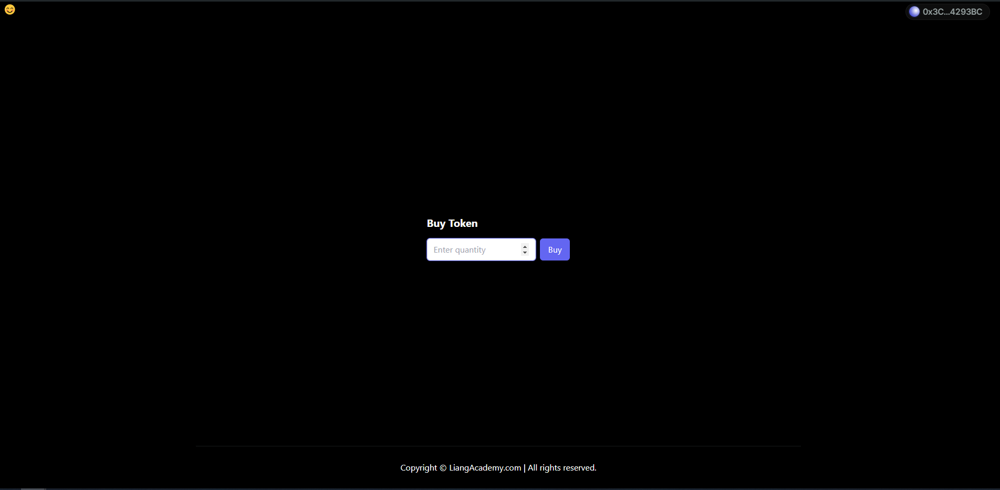

Create a simple ICO project

Our Goal


Demo to student first. 

---

### Create ERC20 and ICO contract (Hardhat)

```
//Open hardhat project and run the following command
npm install --save-dev @openzeppelin/contracts
```

```
//contracts/LiangToken.sol

// SPDX-License-Identifier: MIT
pragma solidity ^0.8.20;

import "@openzeppelin/contracts/token/ERC20/ERC20.sol";
import "@openzeppelin/contracts/access/Ownable.sol";

contract LiangToken is ERC20, Ownable {
    constructor() ERC20("LiangToken", "LTK") Ownable(msg.sender) {
        _mint(msg.sender, 100000 * 10 ** 18);
    }
}

//contracts/ICO.sol
// SPDX-License-Identifier: GPL-3.0

pragma solidity ^0.8.20;

import "@openzeppelin/contracts/token/ERC20/utils/SafeERC20.sol";
import "@openzeppelin/contracts/access/Ownable.sol";
import "@openzeppelin/contracts/utils/Pausable.sol";

using SafeERC20 for IERC20;

contract ICO is Pausable, Ownable {
    IERC20 public token;
    uint public price = 1 ether;
    uint public totalTokensSold;

    constructor(address _tokenAddress) Ownable(msg.sender) {
        token = IERC20(_tokenAddress);
    }

    function buyToken() external payable whenNotPaused {
        uint256 weiAmount = msg.value;
        uint256 numberOfToken = weiAmount / price * 10 ** 18;

        token.safeTransferFrom(owner(), msg.sender, numberOfToken);
        totalTokensSold += numberOfToken;
    }

    function pause() external onlyOwner {
        _pause();
    }

    function unpause() external onlyOwner {
        _unpause();
    }

    function withdrawal() external onlyOwner {
        payable(owner()).transfer(address(this).balance);
    }
}


```


```
//ignition/modules/Deployment.ts

import { buildModule } from "@nomicfoundation/hardhat-ignition/modules";

const DeploymentModule = buildModule("DeploymentModule", (m) => {

    const LiangToken = m.contract("LiangToken");
    const ICO = m.contract("ICO", [LiangToken]);

    const owner = m.getAccount(0);
    const totalSupply = m.staticCall(LiangToken, "totalSupply");
    m.call(LiangToken, 'approve', [ICO, totalSupply], {
        from: owner
    })

    return { LiangToken, ICO };
});

export default DeploymentModule;

```

```
// package.json (modify the the deploy script)

{
  "name": "hardhatstart",
  "version": "1.0.0",
  "main": "index.js",
  "scripts": {
    "deploy": "npx hardhat ignition deploy ./ignition/modules/Deployment.ts --reset --network localhost",
    "test": "REPORT_GAS=true npx hardhat test",
    "compile": "npx hardhat compile"
  },
  "keywords": [],
  "author": "",
  "license": "ISC",
  "description": "",
  "devDependencies": {
    "@nomicfoundation/hardhat-toolbox-viem": "^3.0.0",
    "@openzeppelin/contracts": "^5.0.2",
    "hardhat": "^2.22.4"
  }
}

```

```
//Test Deploy
npx hardhat node
npm run deploy

```

```

//Extra Information
//Get openzeppelin code
https://wizard.openzeppelin.com/

//Command
npm install --save-dev @openzeppelin/contracts

//Test sending token to other account using metamask

Steps
1. Deploy erc20 token smart contract
2. Deploy ico smart contract

```


---

### Create frontend

```shell

npx create-next-app@latest liang_student

//Study
1. Folder structure
2. All the files
```


---

### Add Web3 wrapper into our system. 

```
npm i @reown/appkit @reown/appkit-adapter-wagmi wagmi viem @tanstack/react-query
```

```
//src/utils/web3config.ts

import { cookieStorage, createStorage, http } from "@wagmi/core";
import { WagmiAdapter } from "@reown/appkit-adapter-wagmi";
import { mainnet, arbitrum, hardhat } from "@reown/appkit/networks";

// Get projectId from https://cloud.reown.com
export const projectId = process.env.NEXT_PUBLIC_PROJECT_ID;

if (!projectId) {
  throw new Error("Project ID is not defined");
}

export const networks = [mainnet, arbitrum, hardhat];

export const wagmiAdapter = new WagmiAdapter({
  storage: createStorage({
    storage: cookieStorage,
  }),
  ssr: true,
  projectId,
  networks,
});

export const config = wagmiAdapter.wagmiConfig;


```

```
//src/context/web3.tsx

"use client";

import { wagmiAdapter, projectId } from "@/utils/web3config";
import { QueryClient, QueryClientProvider } from "@tanstack/react-query";
import { createAppKit } from "@reown/appkit/react";
import { mainnet, arbitrum, hardhat } from "@reown/appkit/networks";
import React, { type ReactNode } from "react";
import { cookieToInitialState, WagmiProvider, type Config } from "wagmi";

// Set up queryClient
const queryClient = new QueryClient();

if (!projectId) {
  throw new Error("Project ID is not defined");
}

// Create the modal
const modal = createAppKit({
  adapters: [wagmiAdapter],
  projectId,
  networks: [mainnet, arbitrum, hardhat],
  defaultNetwork: hardhat,
  features: {
    analytics: true,
  },
});

function Web3ContextProvider({
  children,
  cookies,
}: {
  children: ReactNode;
  cookies: string | null;
}) {
  const initialState = cookieToInitialState(
    wagmiAdapter.wagmiConfig as Config,
    cookies
  );

  return (
    <WagmiProvider
      config={wagmiAdapter.wagmiConfig as Config}
      initialState={initialState}
    >
      <QueryClientProvider client={queryClient}>{children}</QueryClientProvider>
    </WagmiProvider>
  );
}

export default Web3ContextProvider;


```

```
// liang_student/.env
// create.env
// Create an account over https://cloud.reown.com/ and get a project id
// /liang_student/.env


NEXT_PUBLIC_PROJECT_ID='yourProjectId'
NEXT_PUBLIC_TOKEN_CONTRACT_ADDRESS="yourTokenAddress"
NEXT_PUBLIC_ICO_CONTRACT_ADDRESS="yourICOContractAddress"

```


```
// src/app/layout.tsx

import type { Metadata } from 'next'
import { Inter } from 'next/font/google'
import './globals.css'

const inter = Inter({ subsets: ['latin'] })

import { headers } from 'next/headers' // added
import Web3ContextProvider from '@/context/web3'

export const metadata: Metadata = {
  title: "Liang ICO Program",
  description: "Sell Token",
};

export default function RootLayout({
  children
}: Readonly<{
  children: React.ReactNode
}>) {

  const headersObj = await headers();
  const cookies = headersObj.get('cookie')

  return (
    <html lang="en">
      <body className={inter.className}>
        <Web3ContextProvider cookies={cookies}>{children}</Web3ContextProvider>
      </body>
    </html>
  )
}


```

---

### Add Header, Footer and Connect Component

```
// app/components/Connect.tsx

import React from "react";

export function Connect() {
  return (
    <div>
      {/* @ts-expect-error msg */}
      <appkit-button
        label="Connect"
        balance="hide"
        size="sm"
        loadingLabel="Connecting"
      />
    </div>
  );
}


```

```
// app/components/Header.tsx

import React from 'react'
import { Connect } from './Connect'

export function Header() {
    return (
        <header className='navbar flex justify-between p-4 pt-0'>
            <h1 className='text-xl font-bold'>😊</h1>
            <div className='flex gap-2'>
                <Connect />
            </div>
        </header>
    )
}

```

```
// app/components/Footer.tsx

import React from 'react'

export function Footer() {
    return (
        <>
            <div className="footer-dark">
                <div className="container xl:max-w-6xl mx-auto px-4 py-4 border-t border-gray-200 border-opacity-10">
                    <div className="row">
                        <div className="col-12 col-md text-center">
                            <p className="d-block my-3">Copyright © LiangAcademy.com | All rights reserved.</p>
                        </div>
                    </div>
                </div>
            </div>
        </>
    )
}


```

```
//Modify src/app/page.tsx

"use client"

import React from 'react'
import { Header } from "./components/Header"
import { Footer } from "./components/Footer"

export default function Home() {
  return <>
    <div className='flex flex-col min-h-screen'>
      <Header />
      <Footer />
    </div>
  </>
}
```


---

### Add React-toastify to the project

```
//Command
npm install --save react-toastify
```

```

//Prompt message - react-toastify
https://fkhadra.github.io/react-toastify/installation

//Change src/app/layout.tsx
// Add import ToastContainer
// Add <ToastContainer />

import type { Metadata } from "next";
import { Inter } from "next/font/google";
import "./globals.css";

const inter = Inter({ subsets: ["latin"] });

import { headers } from "next/headers"; // added
import Web3ContextProvider from "@/context/web3";

import { ToastContainer } from "react-toastify";
import "react-toastify/dist/ReactToastify.css";

export const metadata: Metadata = {
  title: "Liang ICO Program",
  description: "Sell Token",
};

export default async function RootLayout({
  children,
}: Readonly<{
  children: React.ReactNode;
}>) {
  const headersObj = await headers();
  const cookies = headersObj.get("cookie");

  return (
    <html lang="en">
      <body className={inter.className}>
        <Web3ContextProvider cookies={cookies}>{children}</Web3ContextProvider>
        <ToastContainer />
      </body>
    </html>
  );
}

```

```
//Add utils/toast.ts
import { toast, TypeOptions } from 'react-toastify';

export function print(_message: String, _type: TypeOptions) {
    toast(_message, {
        type: _type,
        position: "bottom-right"
    });
}
```

```
//src/app/page.tsx 
//Test toastify

"use client"

import React from 'react'
import { Header } from "./components/Header"
import { Footer } from "./components/Footer"
import { print } from '@/utils/toast'

export default function Home() {

  const notify = () => {
    print('Hello World', 'success')
  }

  return <>
    <div className='flex flex-col min-h-screen'>
      <Header />

      <button onClick={notify}>Click Me!!</button>
      <Footer />
    </div>
  </>
}

```


---

### Add smart contract abi file

```

1. Go to ignition/deployments/chain-31337/artifacts
   - Copy DeploymentModule#ICO.json
   - Copy DeploymentModule#LiangToken.json

2. Paste it into nextjs project /src/abi
	- Rename it to ico.json
	- Rename it to liangToken.json

```


---

### Create smartContractAddress.ts

```
// src/utils/smartContractAddress.ts

export const tokenContractAddress = process.env.NEXT_PUBLIC_TOKEN_CONTRACT_ADDRESS
export const ICOContractAddress = process.env.NEXT_PUBLIC_ICO_CONTRACT_ADDRESS

```


---

### Add BuyToken Component

```
// src/app/components/BuyToken.tsx

'use client'
import { useSimulateContract, useWriteContract, useWaitForTransactionReceipt } from 'wagmi'
import { Address, parseEther } from 'viem'
import { useState, useEffect } from 'react'
import { print } from "@/utils/toast"
import ico from '@/abi/ico.json'
import { ICOContractAddress } from '@/utils/smartContractAddress'


export function BuyToken() {
    const contractAddress = ICOContractAddress as Address
    const [amount, setAmount] = useState('0.01')


    const { error: estimateError } = useSimulateContract({
        address: contractAddress ?? undefined,
        abi: ico.abi,
        functionName: 'buyToken',
        value: parseEther(amount)
    })

    const { data, writeContract } = useWriteContract()

    const {
        error: txError,
        isSuccess: txSuccess,
    } = useWaitForTransactionReceipt({
        hash: data,
    })

    const handleBuyTransaction = () => {
        if (estimateError) {
            print(`Transaction failed: ${estimateError.cause}`, 'error')
            return
        }

        writeContract({
            address: contractAddress ?? undefined,
            abi: ico.abi,
            functionName: 'buyToken',
            value: parseEther(amount)
        })
    }


    const handleQuantityInput = (e: React.ChangeEvent<HTMLInputElement>) => {
        setAmount(e.target.value)
    }


    useEffect(() => {
        if (txSuccess) {
            print(`Transaction successful`, 'success')
        } else if (txError) {
            print(`Transaction failed: ${txError.cause}`, 'error')
        }
    }, [txSuccess, txError])

    return (
        <section className='flex-grow flex justify-center items-center'>
            <div className="card shadow-md rounded-lg overflow-hidden max-w-sm">
                <div className="p-4">
                    <h6 className="text-xl font-bold text-white-800">Buy Token</h6>
                    <div className="flex mt-4">
                        <input onChange={(e) => handleQuantityInput(e)} type="number" className="text-black w-full px-3 py-2 border border-gray-300 rounded-md focus:outline-none focus:ring-1 focus:ring-indigo-500" placeholder="Enter quantity" />
                        <button onClick={handleBuyTransaction} className="ml-2 py-2 px-4 bg-indigo-500 text-white rounded-md hover:bg-indigo-700 focus:outline-none focus:ring-2 focus:ring-offset-2 focus:ring-indigo-500">Buy</button>
                    </div>
                </div>
            </div>
        </section>
    )
}


```

```
//src/app/page.tsx


"use client"

import React from 'react'
import { Header } from "./components/Header"
import { Footer } from "./components/Footer"
import { BuyToken } from './components/BuyToken'

export default function Home() {

  return <>
    <div className='flex flex-col min-h-screen'>
      <Header />
      <BuyToken />
      <Footer />
    </div>
  </>
}

```


---

### Import token address into Metamask


---

### Final Result


---


